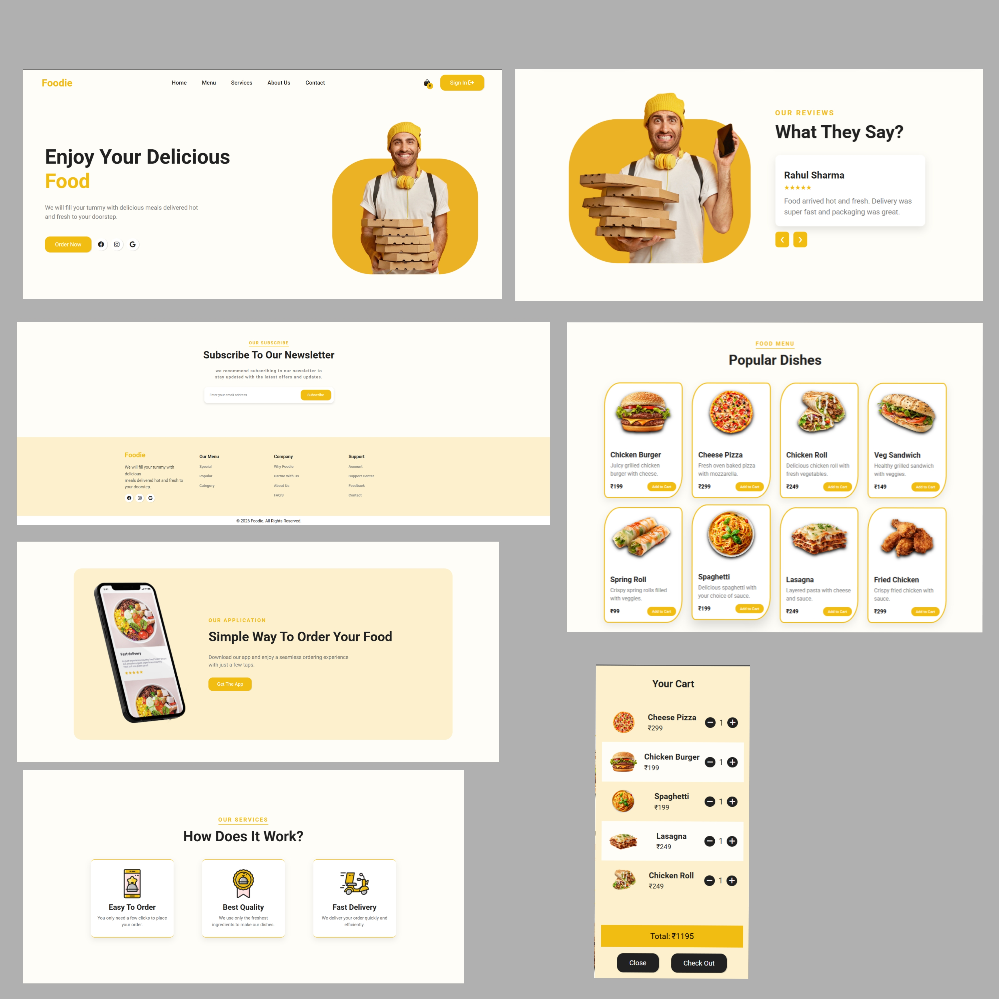
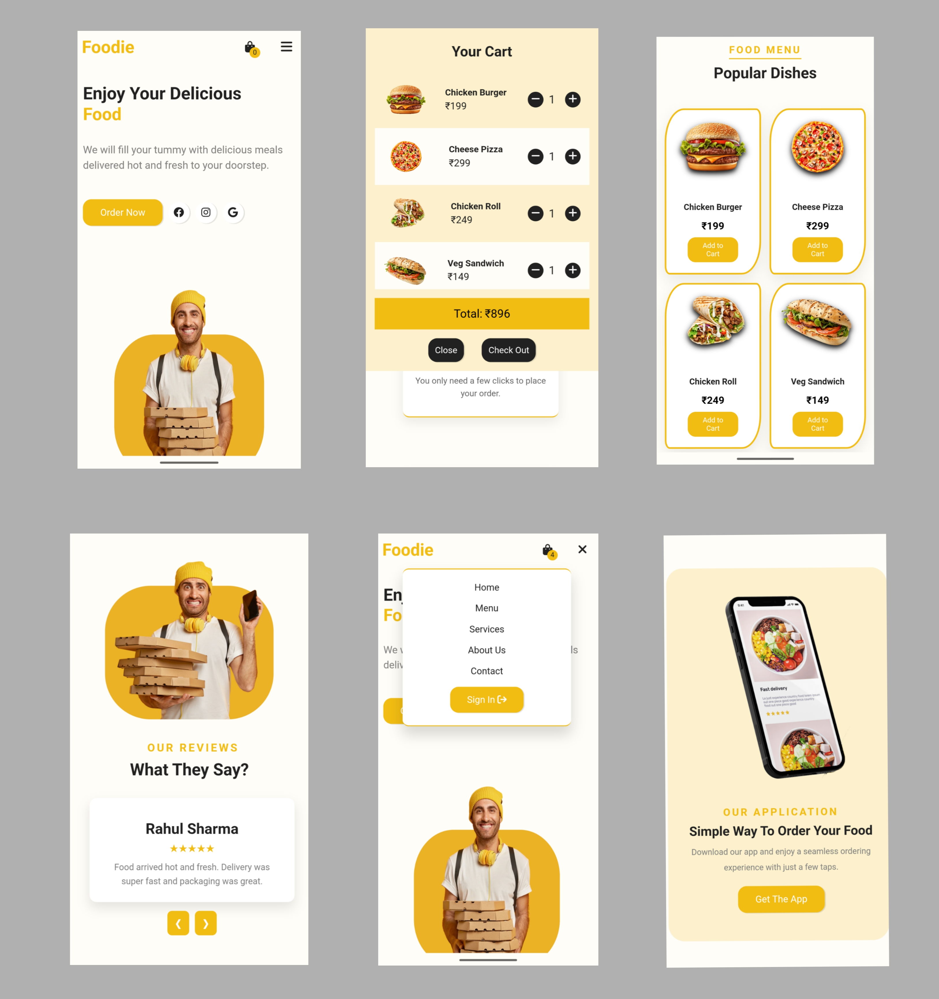

# 🍔 Food Delivery Cart Web App

A responsive **food ordering web app** built with **HTML, CSS, and JavaScript**.
Users can browse items, manage cart, and see real-time price updates.

---

## 🚀 Features

* 🛒 Add to cart (no duplicates)
* ➕ Increase / ➖ Decrease quantity
* ❌ Auto remove when quantity = 0
* 💰 Dynamic total price calculation
* 🔢 Cart item counter (badge)
* 📱 Responsive design
* 🎨 Smooth animations (bounce & slide-out)

---

## 🧠 Concepts Used

* DOM Manipulation
* Event Handling
* Array Methods (`find`, `filter`, `forEach`)
* Dynamic UI Updates

---

## 📸 Project Screenshots

### 🖥 Desktop View




### 📱 Mobile View



---

## ⚙️ How It Works

* Products are stored in a JS array
* Rendered dynamically on UI
* Cart updates in real-time using `updateTotals()`

---

## 📁 Project Structure

```
food-delivery-cart/
├── index.html
├── style.css
├── script.js
├── images/
```

---

## 👨‍💻 Author

**Pawan Patil**

---

## ⭐ Support

If you like this project, give it a ⭐ on GitHub!
